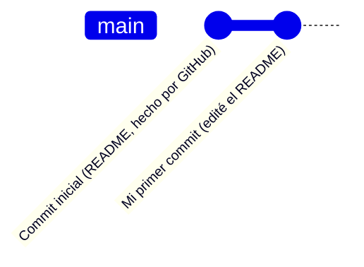
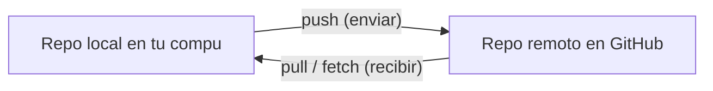
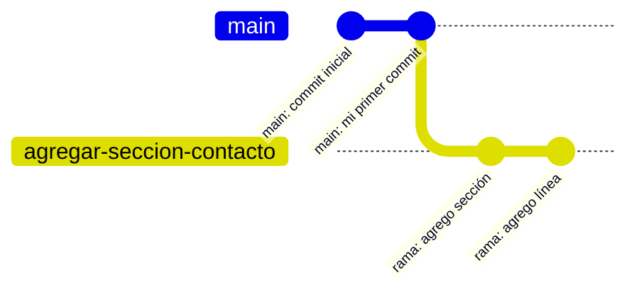
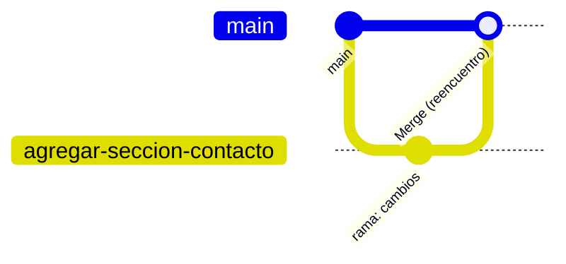
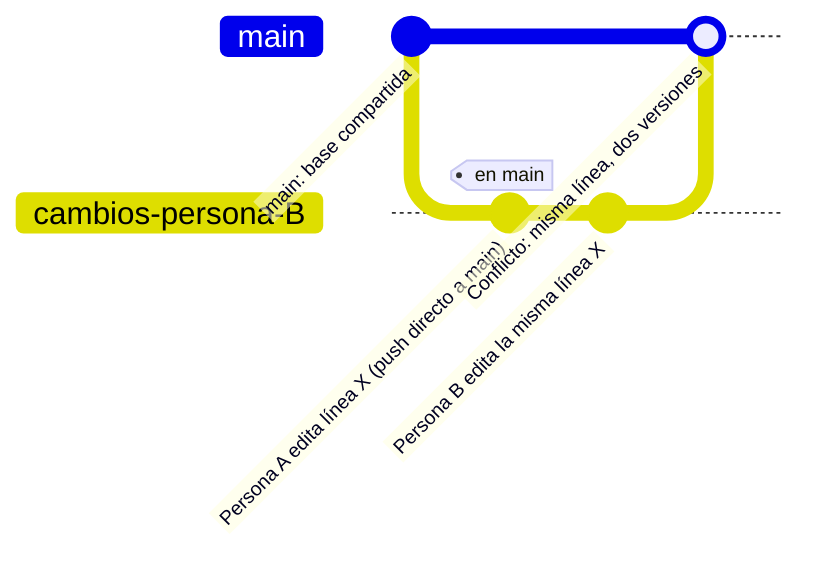
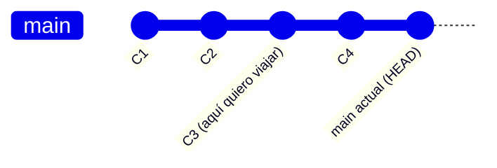
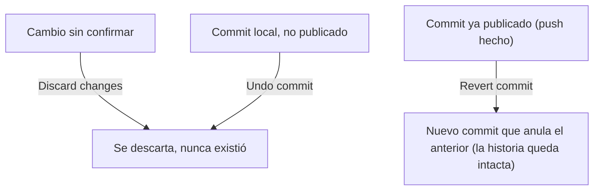
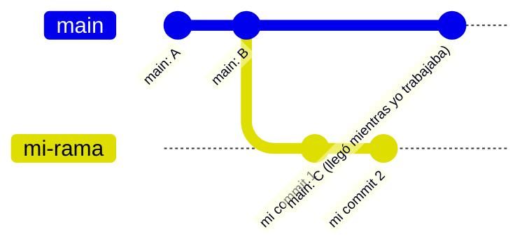
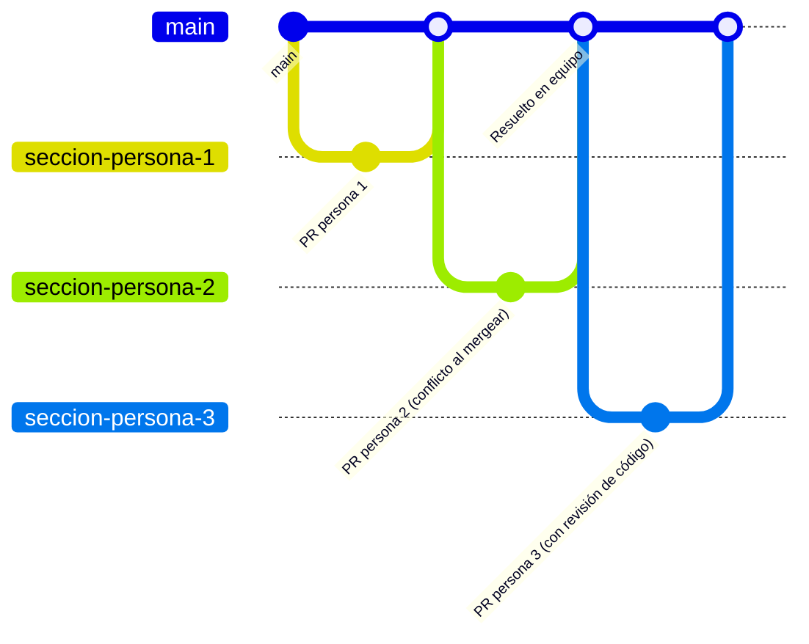

# Guion de clase: Git y GitHub para principiantes
## Versión: 2 sesiones de 4 horas (8 horas totales)

> Formato de la clase: **cero código en pantalla**. Todo se enseña navegando interfaces gráficas: **GitHub Desktop**, **GitHub.com** y **Visual Studio Code** (con extensiones); la terminal se usa **solo si es estrictamente inevitable** (rebase avanzado). Los únicos bloques de texto "técnico" en este documento son diagramas **Mermaid** para visualizar el historial.

---

## 0. Filosofía del guion (léelo antes de dar la clase)

Esta clase está escrita como un guion de película, no como un temario. Cada escena existe para generar una pregunta o una necesidad que **solo la siguiente escena resuelve**. No enseñamos "aquí está el comando push, aquí está el comando pull" como dos entradas de un glosario: enseñamos primero a **recibir** (pull/clone) para que el alumno entienda, por contraste, qué significa **enviar** (push). Lo mismo pasa con ramas → historiales separados → merge → conflicto → viajar en el historial → deshacer → reescribir historia → equipo. Es una escalera: cada peldaño explica por qué existe el siguiente.

Recomendación de puesta en escena: proyecta siempre **tres ventanas** visibles o alternables (el navegador en GitHub.com, GitHub Desktop y VS Code) para que el alumno asocie cada acción con "esto se ve así en las tres herramientas".

### Mapa general (storyboard)

| # | Escena | Tema del temario | Duración | Herramienta protagonista |
|---|--------|-------------------|----------|--------------------------|
| - | Acto 0 | Preparación previa | (antes de clase) | - |
| 1 | Sesión 1 | Qué es GitHub + Nace tu repo (clone/pull + commit) | 60 min | GitHub Web + Desktop |
| 2 | Sesión 1 | El ida y vuelta: Push y Pull | 45 min | GitHub Desktop + Web |
| 3 | Sesión 1 | Bifurcación en una rama + historiales separados | 45 min | GitHub Desktop + VS Code |
| 4 | Sesión 1 | Merge (el reencuentro) | 45 min | GitHub Desktop + GitHub Web (Pull Request) |
| 5 | Sesión 2 | Conflictos de merge | 50 min | VS Code (editor de merge) |
| 6 | Sesión 2 | Checkout de commits: viajar en el historial | 30 min | GitHub Desktop (History) + VS Code (GitLens) |
| 7 | Sesión 2 | Abortar un commit / deshacer | 25 min | GitHub Desktop + VS Code |
| 8 | Sesión 2 | Force y Rebase (la zona peligrosa) | 35 min | GitHub Desktop (+ terminal mínima si aplica) |
| 9 | Sesión 2 | Git colaborativo: repo entre varias personas | 50 min | GitHub Web (Pull Requests) |

---

## Acto 0: Preparación previa (antes de la primera sesión)

Esto no se enseña en clase, es checklist del instructor:

1. Cada alumno debe llegar con **cuenta de GitHub creada** (verificar por correo antes de la clase; recuperar contraseñas en vivo consume tiempo de escena).
2. Instalar previamente: **GitHub Desktop**, **Visual Studio Code**, y tener Git instalado en el sistema (GitHub Desktop lo trae embebido, pero VS Code lo necesita para su panel de "Control de código fuente").
3. Instalar en VS Code, antes de clase, estas extensiones (se explican brevemente en Acto 1, no se instalan en vivo para no perder tiempo con descargas lentas):
   - **GitLens**: ver quién y cuándo cambió cada línea, y navegar el historial visualmente.
   - **Git Graph**: dibuja el árbol de commits y ramas como un mapa de metro.
   - **GitHub Pull Requests and Issues**: crear y revisar Pull Requests sin salir de VS Code.
   - **Markdown Preview Mermaid Support** (opcional, útil si el propio material de clase se ve en VS Code).
4. El instructor crea con anticipación un repositorio de demostración en GitHub (público o de la organización del curso) con un `README.md` simple. Este repo se usa en el Acto 2 para el ejercicio de Pull.
5. Para el Acto 9 (colaborativo), el instructor debe tener lista una organización o un repositorio compartido en GitHub donde pueda agregar a todos los alumnos como colaboradores (o preparar una dinámica de "forks" si prefieres no dar permisos de escritura directos).

---

# SESIÓN 1: "De cero a tu primer merge" (4 horas)

**Arco narrativo de la sesión:** el alumno nace como usuario de Git (no sabe nada) → obtiene su primer repositorio → entiende que un repo vive en dos lugares (local y remoto) y aprende a sincronizarlos → descubre que puede crear líneas de tiempo paralelas (ramas) → las vuelve a unir (merge). La sesión cierra con una victoria: "ya sé programar sin código, ya sé fusionar historia". El cliffhanger de cierre es la pregunta que abre la Sesión 2: *"¿qué pasa si dos personas cambiaron la misma línea?"*

---

### 🎬 Escena 1: "¿Qué es esto y por qué debería importarme?" + Nace tu primer repo (60 min)

**Objetivo pedagógico:** que el alumno entienda, con ejemplos visuales (no abstractos), qué es Git, qué es GitHub y la diferencia entre ambos; y que termine con su propio repositorio funcionando localmente, entendiendo además que ese repositorio local no es más que una carpeta en su disco.

**Gancho de apertura:** no empieces definiendo Git. Empieza mostrando en pantalla el historial de commits de un repo real y conocido (por ejemplo, un repo popular de código abierto, o el propio repo del curso). Pregunta: *"¿alguna vez han trabajado en un documento de Word llamado `final_v2_definitivo_YA.docx`? Esto es lo que reemplaza a eso."*

**Guion paso a paso:**

1. **Qué es Git vs. qué es GitHub** (analogía visual, sin jerga):
   - Git = el sistema de "guardado con memoria" que vive en tu computadora. Cada "guardado" (commit) es una fotografía completa del proyecto en ese instante, no solo un reemplazo del archivo anterior.
   - GitHub = una casa en internet donde guardas una copia de esas fotografías, para no perderlas si tu computadora muere, y para que otras personas puedan verlas o colaborar.
   - Muestra en el navegador un repositorio real: la lista de archivos, la pestaña "Commits" y cómo cada commit es un punto en una línea de tiempo.
2. **Crear el repositorio, empezando en GitHub.com (Web) y no en la computadora.** Esto es deliberado: el alumno ve primero que el repo "nace" en la nube.
   - En GitHub.com: botón **New repository** → nombre → marcar "Add a README file" → Create repository.
   - Señala: este README ya es un primer commit, hecho por GitHub mismo. El repo ya tiene una historia de un evento antes de que el alumno haya tocado su propia computadora.
3. **Traer ese repo a la computadora: aquí, sin nombrarlo aún como "concepto", el alumno ya está haciendo un pull/clone.**
   - Abrir **GitHub Desktop** → `File > Clone Repository` → pestaña "GitHub.com" → seleccionar el repo recién creado → Clone.
   - Frase clave para decir en voz alta: *"Lo que acaban de hacer se llama clonar, y en el fondo es la primera vez que 'jalan' (pull) información desde GitHub hacia su compu. Recuérdenlo, porque en la próxima escena vamos a usar esta misma idea para explicar su opuesto."*
4. **Desvío breve, pero clave: mirar la carpeta con ojos "de sistema operativo", no solo de Git.**
   - En GitHub Desktop: menú `Repository > Show in Explorer` (Windows) o `Show in Finder` (Mac). Esto abre, literalmente, el Explorador de archivos de Windows o el Finder de Mac justo en la carpeta del proyecto.
   - Muestra que ahí adentro solo hay archivos normales (el `README.md`, nada exótico): se pueden abrir con doble clic, copiar, renombrar o borrar exactamente igual que cualquier otra carpeta del sistema, porque **es** una carpeta cualquiera del sistema.
   - Activa la opción de ver archivos ocultos (Windows: pestaña "Vista" del Explorador → "Elementos ocultos"; Mac: `Cmd+Shift+.` en Finder) y señala la carpeta `.git` que aparece ahí adentro.
   - Frase clave para decir en voz alta: *"Toda la magia de Git y de GitHub Desktop vive dentro de esta carpeta `.git`. No hay ningún servidor escondido ni ninguna base de datos externa: es información guardada en tu disco, en esta carpeta, que ustedes podrían copiar, respaldar en un USB o mandar por correo si quisieran. Todo lo que hagamos hoy con clics, en el fondo, es leer y escribir ahí adentro."*
   - Nota para el instructor: no es necesario (ni recomendable) que abran o editen algo dentro de `.git`; el objetivo es solo que dejen de verla como una "caja negra" y la reconozcan como una carpeta real y visible.
5. **Abrir el repo en VS Code:**
   - Desde GitHub Desktop: botón "Open in Visual Studio Code".
   - Mostrar el ícono de **Control de código fuente** en la barra lateral (el tercer ícono, con forma de rama).
6. **Editar y hacer el primer commit real del alumno:**
   - Editar el `README.md` en VS Code (agregar una línea con su nombre, por ejemplo).
   - En VS Code: panel de Control de código fuente muestra el archivo como "cambiado". Escribir un mensaje de commit corto y claro, botón **Commit**.
   - Alternativa/reforzar en GitHub Desktop: mostrar la misma pantalla de "Changes", con el diff coloreado (verde = agregado, rojo = quitado), escribir el resumen del commit y botón **Commit to main**.
   - Explicar el mensaje de commit como "la etiqueta de la fotografía": debe explicar el *por qué*, no el *qué* (el diff ya dice el qué).

**Diagrama (línea de tiempo del repo hasta ahora):**

**Errores comunes de alumnos / preguntas esperadas:**
- Confundir "Save" del editor con "Commit": enfatizar que guardar el archivo y confirmar el cambio en Git son dos pasos distintos.
- No saber por qué el mensaje de commit importa: mostrar un historial real con mensajes malos (`"fix"`, `"asdf"`, `"cambios"`) vs. buenos.
- "¿Ya se subió a internet?": no, todavía no. Ese es exactamente el gancho de la siguiente escena.
- "¿Puedo mover o renombrar la carpeta del proyecto desde el Explorador/Finder?": sí, es una carpeta normal; lo único delicado es no tocar el contenido interno de `.git` a mano.

**Transición (cliffhanger hacia la Escena 2):** *"Tu commit existe... pero solo en tu computadora, en esa carpeta que acabamos de ver. Si tu laptop se moja ahora mismo, se pierde. ¿Cómo lo mandamos de vuelta a la nube?"*

---

### 🎬 Escena 2: "El ida y vuelta: Push y Pull" (45 min)

**Objetivo pedagógico:** que el alumno entienda push y pull no como botones sueltos, sino como las dos direcciones de una misma calle, y que experimente un pull "real" (traer un cambio que no hizo él) antes del push final.

**Gancho:** retoma la escena anterior: "recuerdan que clonar era como un primer pull. Ahora formalicemos la palabra **push**: es lo contrario, mandar tu fotografía local hacia la nube."

**Guion paso a paso:**

1. **Push (enviar):**
   - En GitHub Desktop: el botón superior ahora dice **"Push origin"** (con un contador de 1 commit pendiente). Clic.
   - Cambiar a GitHub.com en el navegador, refrescar la página del repo: mostrar en vivo cómo el README ya refleja el cambio, y cómo aparece el commit nuevo en la pestaña "Commits". Este es el momento de mayor impacto visual de la escena: "lo que hiciste en tu compu ya existe en la nube, en tiempo real".
2. **Pull (recibir), pero esta vez provocado por otra persona, no por ti:**
   - Pide a los alumnos que abran el repositorio de **demostración del instructor** (el preparado en el Acto 0) en GitHub.com y editen directamente el archivo `README.md` **desde el navegador** (ícono de lápiz, editar, "Commit changes directly to the main branch"). Esto es intencional: enseña que GitHub Web también es una herramienta de edición legítima, no solo un visor.
   - El instructor, en su propio GitHub Desktop (que ya tenía ese repo clonado), muestra que **no aparece nada nuevo todavía**. Pregunta retórica: "¿por qué mi compu no se enteró si ya lo veo en la web?"
   - Clic en **Fetch origin** (mostrar qué hace: solo *revisa* si hay novedades, no las trae) y luego **Pull origin** (ahora sí las trae). Mostrar el archivo actualizándose localmente.
3. **Cerrar el ciclo:** cada alumno hace un segundo commit pequeño en su propio repo y hace push de nuevo, para automatizar el músculo push → verificar en la web → (opcional) pull.

**Diagrama (dos copias del mismo repo sincronizándose):**

**Preguntas/errores comunes:**
- Confundir Fetch con Pull: Fetch es "mirar el buzón", Pull es "abrir el buzón y meter las cartas a tu escritorio".
- Miedo a hacer push "y romper algo": tranquilizar; mientras nadie más haya tocado el mismo archivo remoto, push siempre funciona sin fricción (la fricción llega en la Sesión 2, y ese es justo el gancho que sembramos).

**Transición:** *"Hasta ahora todos hemos trabajado en una sola línea de tiempo (`main`). ¿Qué pasa si yo quiero probar algo arriesgado sin arruinar la versión que ya funciona?"*

---

### 🎬 Escena 3: Bifurcación en una rama + historiales separados (45 min)

**Objetivo pedagógico:** entender una rama como una línea de tiempo paralela, y ver con los propios ojos cómo dos ramas acumulan commits distintos (historiales separados) sin afectarse entre sí.

**Guion paso a paso:**

1. **Analogía visual:** dibuja (o muestra ya dibujado) el `main` como una carretera recta. Una rama es un desvío que sale de un punto exacto de esa carretera y puede tener sus propias paradas (commits) sin tocar la carretera original.
2. **Crear la rama, en GitHub Desktop:**
   - Botón **Current branch** (arriba) → **New branch** → nombre descriptivo (ej. `agregar-seccion-contacto`) → Create branch.
   - Señalar que GitHub Desktop cambia automáticamente a esa rama ("Switch to this branch").
3. **Ver la rama en VS Code:**
   - Abajo a la izquierda, el nombre de la rama activa (icono de rama). Clic ahí abre el mismo selector de ramas que en Desktop: mismo concepto, dos ventanas.
4. **Generar historial separado:**
   - En esta rama, el alumno hace **2 commits distintos** (ej. agregar una sección al README, luego agregar otra línea). Push de la rama (`Publish branch` en Desktop).
   - Cambiar de vuelta a `main` en Desktop/VS Code y mostrar: el README en `main` **no tiene** esos cambios. Las dos líneas de tiempo son independientes.
5. **Ver el árbol completo:**
   - Instalar/mostrar **Git Graph** en VS Code (ya debería estar instalado desde el Acto 0): abrir la vista y mostrar visualmente cómo `main` y la nueva rama se separan desde un mismo punto.
   - Alternativa: en GitHub.com, la pestaña **Insights → Network** también dibuja esto.

**Diagrama:**

**Preguntas/errores comunes:**
- "¿La rama nueva tiene una copia de todo?": sí, tiene todo lo de `main` hasta el punto de bifurcación, más lo propio.
- Alumnos que editan sin fijarse en qué rama están parados: remarcar el hábito de **siempre mirar la rama activa** antes de editar, tanto en Desktop como en la barra inferior de VS Code.

**Transición:** *"Tenemos dos historias que crecieron por separado. Se ve genial en el diagrama... pero en algún momento necesitamos que esa idea de la rama vuelva a vivir en `main`. ¿Cómo juntamos dos historias en una?"*

---

### 🎬 Escena 4: Merge, el reencuentro (45 min)

**Objetivo pedagógico:** ejecutar un merge sin conflicto (a propósito, para que la victoria sea limpia) usando dos caminos distintos, merge local en GitHub Desktop y merge vía Pull Request en GitHub Web, porque ambos son realistas en el mundo profesional.

**Guion paso a paso:**

1. **Camino A: Merge local (rápido, para equipos pequeños o cambios propios):**
   - En GitHub Desktop, parado en `main`: menú **Branch → Merge into current branch** → seleccionar `agregar-seccion-contacto` → Merge.
   - Mostrar el resultado en Git Graph: las dos líneas se reencuentran visualmente en un punto.
2. **Camino B: Merge vía Pull Request (el camino real de equipos profesionales, y puente directo hacia el Acto 9):**
   - Cada alumno crea una **segunda rama nueva** para no repetir el merge ya hecho, hace un commit, y la publica (push).
   - En GitHub.com: aparece un banner "Compare & pull request" → clic → título y descripción → **Create pull request**.
   - Mostrar la pestaña **"Files changed"** (el diff, igual de coloreado que en Desktop/VS Code: mismo lenguaje visual en las tres herramientas).
   - Botón **Merge pull request** → **Confirm merge**.
   - Volver a GitHub Desktop, hacer **Pull** en `main`: el cambio aparece localmente. (Refuerzo directo del pull de la Escena 2.)

**Diagrama:**

**Preguntas/errores comunes:**
- "¿Se borra la rama después del merge?": no automáticamente en Desktop; en GitHub Web, el botón "Delete branch" aparece después de mergear el PR, y es buena práctica usarlo para no acumular ramas muertas.
- Confundir "Pull Request" con un "Pull" de sincronización: son cosas distintas con el mismo nombre; distinguir con claridad: un Pull Request es una **propuesta de merge para revisión**, un Pull (sin "Request") es **sincronizar tu copia local**.

**Transición / cierre de Sesión 1:** *"Hoy tu historia se separó y se volvió a juntar sin ningún problema, porque nadie más tocó las mismas líneas. La próxima sesión empieza con la pregunta que nadie quiere enfrentar en su primer trabajo: ¿qué pasa cuando dos personas editan exactamente la misma línea del mismo archivo? Eso se llama conflicto, y ahí empezamos la Sesión 2."*

---

# SESIÓN 2: "Cuando la historia se complica" (4 horas)

**Arco narrativo de la sesión:** empezamos resolviendo el miedo más grande de un principiante (el conflicto), seguimos dándole al alumno superpoderes de "viajar en el tiempo" y "deshacer" (para que pierda el miedo a romper algo), subimos la apuesta con la herramienta más peligrosa (force/rebase, con advertencias explícitas), y cerramos llevando todo lo aprendido a un escenario real: un repositorio con varias personas trabajando a la vez.

---

### 🎬 Escena 5: Conflictos de merge (50 min)

**Objetivo pedagógico:** provocar un conflicto real, en vivo, a propósito, y resolverlo con el editor visual de VS Code, para que el alumno entienda que un conflicto no es un error grave, sino una pregunta que Git no puede responder solo.

**Gancho:** recuerda el cliffhanger de cierre de la Sesión 1 y anuncia: *"vamos a provocar uno a propósito, en un ambiente seguro, para que la primera vez que les pase de verdad no les dé pánico."*

**Guion paso a paso:**

1. **Preparar el choque (a propósito):**
   - Con los alumnos en parejas (o el instructor contra un alumno voluntario), ambos parten del mismo commit en `main`.
   - Persona A edita la **misma línea** de `README.md` y hace push directo a `main`.
   - Persona B, sin haber hecho pull todavía, edita esa misma línea con un texto distinto y trata de hacer push.
2. **Mostrar el rechazo:**
   - GitHub Desktop rechaza el push ("This branch is X commits behind...") y ofrece **Fetch/Pull**.
   - Al hacer pull, GitHub Desktop avisa explícitamente: **"There are conflicts"** y lista los archivos afectados.
3. **Resolver el conflicto, con VS Code como protagonista:**
   - Abrir el archivo conflictuado en VS Code: aparecen los bloques `<<<<<<< HEAD` / `=======` / `>>>>>>>` resaltados, con botones inline: **Accept Current Change**, **Accept Incoming Change**, **Accept Both Changes**, **Compare Changes**.
   - Explicar cada botón con la analogía de "dos borradores del mismo párrafo: ¿te quedas con el tuyo, con el de tu compañero, con ambos, o escribes uno nuevo a mano?"
   - Elegir una resolución, guardar el archivo.
4. **Cerrar el conflicto:**
   - Volver a GitHub Desktop: el archivo ya no aparece en conflicto → se arma un **commit de merge** (mensaje ya sugerido automáticamente, se puede dejar así) → Commit → Push.
   - Confirmar en GitHub.com que el archivo final combina lo esperado.

**Diagrama (por qué ocurre el conflicto):**

**Preguntas/errores comunes:**
- Pánico al ver los símbolos `<<<<<<<`: normalizarlo; "esto no es un error del sistema, es Git preguntándote algo directamente, en el propio archivo".
- Querer cerrar VS Code y empezar de cero: mostrar primero la Escena 7 (abortar) como red de seguridad, o adelantar mentalmente que existe un botón de pánico.
- Olvidar hacer el commit final después de resolver: el conflicto no se "cierra" hasta que se confirma el commit de merge.

**Transición:** *"Resolvieron un conflicto sin perder la cabeza. Pero para entender bien qué pasó, a veces necesitamos ver el historial completo y hasta 'viajar' a un punto anterior. Vamos a aprender a movernos en el tiempo."*

---

### 🎬 Escena 6: Checkout de commits, viajar en el historial (30 min)

**Objetivo pedagógico:** que el alumno pueda inspeccionar y visitar cualquier punto pasado del historial sin miedo a "romper" el presente.

**Guion paso a paso:**

1. **Ver el historial completo:**
   - GitHub Desktop → pestaña **History**: lista cronológica de commits, con el diff de cada uno al hacer clic.
   - VS Code con **GitLens**: pasar el mouse sobre cualquier línea del archivo muestra quién y cuándo la cambió por última vez (blame inline); puente directo hacia "por qué esta línea dice esto".
   - **Git Graph**: clic derecho sobre cualquier commit del árbol.
2. **Viajar a un commit pasado (checkout):**
   - Desde Git Graph o desde History en Desktop: clic derecho sobre un commit antiguo → **Checkout** (en Desktop suele ofrecerse como "Create branch from this commit" para no perder el lugar; explicar la diferencia entre "mirar" y "pararse ahí a trabajar").
   - Mostrar el estado real de los archivos en ese punto exacto del pasado: como poner el reproductor de video en pausa en un minuto específico.
   - Volver al presente: checkout de vuelta a `main` (o a la rama donde se estaba trabajando).
3. **Analogía de cierre:** el historial de Git es como el control deslizante de una línea de tiempo de video: puedes pausar en cualquier segundo, ver ese fotograma, y seguir después sin haber "movido" el video original.

**Diagrama:**

**Preguntas/errores comunes:**
- Miedo a "quedarse atrapado en el pasado" (detached HEAD): explicarlo como una foto, no como una obra en construcción; mirar no compromete a nada, solo compromete si empiezas a hacer commits ahí sin crear una rama.

**Transición:** *"Ya sabemos mirar el pasado. Pero ¿y si el error no está en el pasado lejano, sino que fue el commit de hace 30 segundos? Ahí no queremos viajar, queremos deshacer."*

---

### 🎬 Escena 7: Abortar un commit / botón de pánico (25 min)

**Objetivo pedagógico:** dar al alumno herramientas seguras para deshacer errores recientes, quitando el miedo residual de las escenas anteriores.

**Guion paso a paso:**

1. **Deshacer cambios no confirmados (antes del commit):**
   - En VS Code, panel de Control de código fuente: clic derecho sobre un archivo modificado → **Discard Changes**.
   - En GitHub Desktop: clic derecho sobre el archivo en la lista de "Changes" → **Discard changes**.
2. **Deshacer el último commit (ya confirmado, no publicado):**
   - GitHub Desktop: menú **Branch → Undo commit** (o el botón "Undo" que aparece justo después de comitear). Explicar que esto regresa los cambios a "no confirmados", no los borra del disco.
3. **Abortar un merge en curso (cuando el conflicto de la Escena 5 da miedo y quieres cancelar todo):**
   - GitHub Desktop, durante un conflicto: botón **Abort merge**. Vuelve todo al estado justo antes de intentar el merge.
4. **Revertir un commit ya publicado (para cuando "Undo" ya no es opción porque otros ya lo tienen):**
   - GitHub Desktop: clic derecho sobre un commit en History → **Revert this commit**. Explicar que esto no borra historia, **crea un commit nuevo que deshace** el anterior: la diferencia conceptual clave antes de entrar a la siguiente escena, donde sí se reescribe historia.

**Diagrama (revert vs. undo, conceptual):**

**Preguntas/errores comunes:**
- Confundir "Undo" con "Revert": Undo reescribe (solo es seguro si nadie más ya tiene ese commit); Revert es seguro siempre porque no borra nada, solo agrega.

**Transición:** *"Revert es la opción segura. Pero existe una opción insegura pero poderosa: reescribir la historia de verdad. Se llama rebase, y viene con una advertencia grande."*

---

### 🎬 Escena 8: Force y Rebase, la zona peligrosa (35 min)

**Objetivo pedagógico:** que el alumno entienda *qué problema resuelve* rebase (una historia más limpia y lineal) y *por qué da miedo* (reescribe commits ya existentes), sin necesitar usarlo con soltura todavía; es una escena de "conocer el arma", no de "dominarla".

**Advertencia explícita para decir en voz alta, textual, al alumno:** *"Todo lo que vimos hasta ahora es seguro para equipos. Esto que van a ver ahora puede borrar el trabajo de un compañero si se usa mal en una rama compartida. Es información importante, pero úsenla con cuidado, y jamás en `main` sin avisar al equipo."*

**Guion paso a paso:**

1. **Qué problema resuelve el rebase (mostrar, no ejecutar todavía):**
   - Volver al Git Graph de una rama con varios merges cruzados: mostrar cómo se ve "spaghetti".
   - Contrastar con un historial rebaseado: una línea recta, como si los commits de la rama se hubieran creado *después* de los últimos cambios de `main`, en lugar de en paralelo.
2. **Antes de arriesgarse: el respaldo manual, el que no es de Git.**
   - Recuerda con el grupo lo que vieron en la Escena 1: el repositorio es, en el fondo, una carpeta con un `.git` adentro. Eso significa que, además de las herramientas de Git, siempre existe una red de seguridad low-tech: copiar y pegar toda la carpeta del proyecto en otro lugar (o comprimirla en un `.zip`) antes de un rebase o un force push que dé nervios.
   - Frase clave: *"No sustituye a un buen manejo de ramas ni a lo que ya aprendieron en 'Abortar un commit', pero es un respaldo manual perfectamente válido, precisamente porque no hay nada mágico o inaccesible dentro de esa carpeta."*
3. **Ejecutar un rebase simple (GUI primero):**
   - GitHub Desktop: menú **Branch → Rebase current branch onto main** (disponible cuando la rama está desactualizada respecto a `main`). Mostrar el resultado en Git Graph: la rama ahora "sale" desde el commit más reciente de `main`.
   - Si aparecen conflictos durante el rebase, se resuelven exactamente igual que en la Escena 5 (mismo editor de VS Code); remarcar que ya saben hacerlo.
4. **Qué es Force Push y por qué Git lo bloquea por default:**
   - Después de un rebase, el push normal fallará ("tip of your branch is behind"), porque técnicamente se reescribieron commits que ya existían en el remoto.
   - GitHub Desktop ofrece el botón **"Force push origin"**: mostrarlo, explicar la casilla de confirmación/advertencia que Desktop muestra antes de permitirlo.
   - Regla de oro para repetir: *force push solo en tus propias ramas de trabajo, nunca en ramas compartidas por el equipo sin coordinarlo primero.*
5. **(Opcional, solo si el grupo va bien de tiempo) Mención de la terminal:** aquí es el único punto de la clase donde se puede *mostrar* (no necesariamente usar) que existen los comandos `git rebase` y `git push --force`, como referencia de que todo lo que hicimos con clics tiene un equivalente de texto, sin profundizar.

**Diagrama (antes / después del rebase):**

*(Después del rebase, en el discurso: "mi commit 1" y "mi commit 2" se re-dibujan como si salieran justo después de "main: C", en línea recta; vale la pena dibujarlo a mano en pizarrón o mostrarlo ya hecho en Git Graph con un ejemplo real.)*

**Preguntas/errores comunes:**
- "¿Rebase borra mi trabajo?": no, lo reubica; el riesgo real es cuando alguien más ya construyó sobre los commits viejos que el rebase reemplaza.
- Ansiedad ante el botón "Force": reforzar la regla de oro y seguir.

**Transición:** *"Ya tienen todas las herramientas individuales: crear, sincronizar, ramificar, fusionar, resolver conflictos, viajar en el tiempo, deshacer, y hasta reescribir historia. Es hora de usarlas todas a la vez, con otras personas, en el mismo repositorio, al mismo tiempo. Así es un repo de verdad."*

---

### 🎬 Escena 9: Git colaborativo, un repositorio con varias personas (50 min)

**Objetivo pedagógico:** cerrar la clase con una simulación realista de trabajo en equipo, usando Pull Requests como mecanismo central de colaboración y revisión; el broche que conecta todas las escenas anteriores.

**Guion paso a paso:**

1. **Preparar el repo compartido:**
   - El instructor agrega a todos los alumnos como **colaboradores** del repositorio compartido (Settings → Collaborators en GitHub.com), o los organiza en equipos de 3-4 con un repo por equipo.
2. **Dinámica: cada persona, su propia rama:**
   - Cada alumno crea su propia rama desde `main` (GitHub Desktop), nombrada con su nombre o tarea (ej. `seccion-isaac`).
   - Cada quien edita una sección distinta de un mismo archivo compartido (ej. un `README.md` tipo "presentación del grupo", cada quien agrega su propia sección), diseñado a propósito para que **no** choquen todavía, para practicar primero el flujo limpio de PR.
3. **Pull Request + revisión de código (GitHub Web, protagonista de esta escena):**
   - Cada alumno publica su rama y abre un Pull Request.
   - Los alumnos se asignan entre sí como **revisores** (Reviewers, en la barra lateral del PR) y dejan al menos un comentario en la pestaña "Files changed" (clic sobre una línea → escribir comentario).
   - El autor responde el comentario o hace un ajuste y empuja un nuevo commit al mismo PR (mostrar que el PR se actualiza solo).
4. **Mergear en cadena, y aquí sí, a propósito, un conflicto real de equipo:**
   - Mergear los PRs uno por uno. Como todos parten del `main` original, es probable que el segundo o tercer PR entre en conflicto al querer mergear (porque el archivo ya cambió con el PR anterior); GitHub Web mostrará **"This branch has conflicts that must be resolved"**.
   - Resolver ese conflicto: opción simple desde GitHub Desktop (pull de `main` actualizado dentro de la rama del PR, resolver en VS Code como en la Escena 5, push); cierre perfecto de círculo con todo lo aprendido.
5. **Cierre de la clase:**
   - Mostrar el Git Graph final del repo compartido: una historia con múltiples ramas, todas fusionadas, con nombres de todos los alumnos.
   - Recapitular el mapa completo del curso apuntando a cada nodo del gráfico: "esa rama fue la Escena 3, ese merge fue la Escena 4, ese conflicto fue la Escena 5..."

**Diagrama (repo colaborativo final):**

**Preguntas/errores comunes:**
- No saber quién revisa a quién: asignar explícitamente parejas antes de empezar la dinámica.
- Miedo a comentar el código de un compañero: normalizar la revisión como parte natural del flujo, no como crítica personal.

**Cierre general del curso (5-10 min dentro de esta escena):**
- Resumen de una frase por escena (el "trailer" completo del curso, ahora que ya lo vivieron).
- Recursos para seguir practicando: repetir la dinámica del Acto 9 con un proyecto propio, explorar GitLens más a fondo, animarlos a usar Pull Requests desde ya en cualquier proyecto personal.

---

## Notas finales para el instructor

- Todas las escenas están diseñadas para **no depender de que el alumno escriba comandos**. Si en algún punto un alumno pregunta "¿y esto qué comando es?", está bien mostrar el comando equivalente como dato cultural, pero no es necesario para avanzar en la clase.
- Los tiempos son orientativos; las escenas con mayor riesgo de desvío por preguntas son la 5 (conflictos) y la 9 (colaborativo). Si el grupo es grande, considera 5-10 minutos extra de colchón ahí, tomados de la Escena 1 (que suele sobrar tiempo si los alumnos ya llegan con cuenta creada).
- Todos los diagramas de este documento son Mermaid `gitGraph` o `flowchart` y se pueden proyectar directamente si abres este archivo en un visor de Markdown con soporte Mermaid (VS Code con la extensión sugerida, o cualquier visor compatible).
